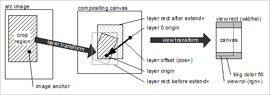

# Platzierung der Ebene{#layer-placement}

Ebenen werden positioniert, indem der Ebenenursprung (Origin=) mit dem Hintergrund-Ebenenursprung an einem durch Pos= angegebenen Versatz ausgerichtet wird.

Wenn der Ebenenursprung für eine Bildebene nicht explizit angegeben ist, wird er wie folgt berechnet:

1. Bestimmen Sie den Bildanker. Verwenden Sie `anchor=` oder, falls nicht anders angegeben, `catalog::Anchor`.
1. Wenn der Bildanker definiert ist, wenden Sie die Ebenentransformationen und `extend=` an, um sie in einen Origin=-Wert zu konvertieren.
1. Wenn kein Bildanker definiert ist, wird der Ebenenursprung (nach dem Anwenden von `extend=`) in der Mitte des Ebenenrechtecks platziert.

